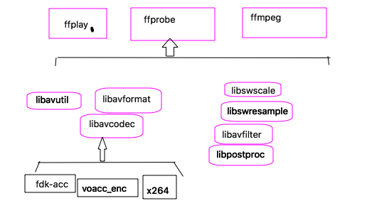
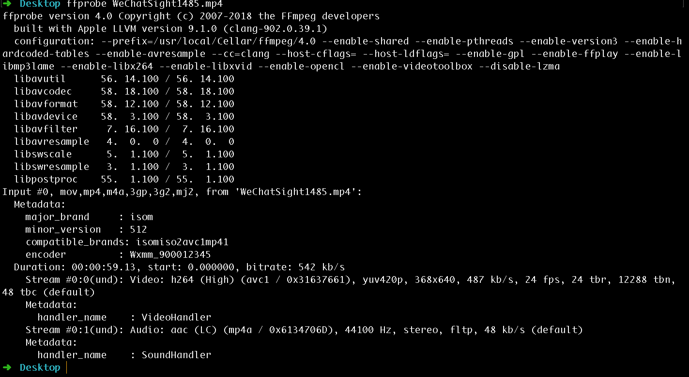

ffmpeg 的编译 与命令行工具

1、 ffmpeg (fast forward MPEG)【mpeg 是编码的标准】
提供了一套可以用来记录、处理数字音频、视频，并将其转换为流的开源框架；提供了录制，转换以及流音视频的完整解决方案。

ffmpeg 结构图



ffmpeg可以通过源码进行编译生成， 一般都是符合GUN的软件方式配置；
mac 上也是可以直接通过打包好的文件进行安装。

```
默认的编译生成：
4个可执行文件和8个静态库，
可执行文件： 
1）转码、推流、Dump媒体文件的ffmpeg
2）用于播放媒体文件的ffplay
3）用于获取媒体文件信息的ffprobe
4）作为简单流媒体服务器的ffserver

8个静态库（ffmpeg的8个模块）
AVUtil ：核心工具库
AVFormat ： 文件格式和协议库
AVCodec： 编解码库
AVFilter： 音视频滤镜库
AVDevice： 输入和输出设备库
SwrRessample： 用于音视频重采样
SWSScale ： 将图像进行格式转换模块
PostProc： 用于进行后台处理
```

ffmpeg 命令行工具的使用
客户单： ffmpeg /ffplay /ffprobe
服务器： ffserver

1、ffprobe

`
1）在上面的截图中可以看到，这首歌的市场是00:05:07.28， 开始时间是 0.025056，整个文件的比特率是329kbit/s
`
`  
2）下一行（第一个流）： 音频流， 格式： mp3 采样率：44100Hz 声道：(stereo)立体声， 采样格式：fltp （float planner）[p: 表示的是平铺（planner）]，路流比特率是：320kb/s
`


`
matadata信息： 
 encoder         : Wxmm_900012345 表示输出格式是Wxmm， 后面的数字是ffmpeg的代号；
`
`
下一个部分是时间，  Duration: 00:00:59.13, start: 0.000000, bitrate: 542 kb/s ， 可以知道对应的时间以及开始时间， 比特率等等；
`
`
Stream #0:0(und): Video: h264 (High) (avc1 / 0x31637661), yuv420p, 368x640, 487 kb/s, 24 fps, 24 tbr, 12288 tbn, 48 tbc (default)
表示第一个流是视频流， 编码格式是h264（封装格式是AVC1），每一帧的数据表示的是yuv420p格式，分辨率是：368x640 ， 路流的比特率是：487 kb/s ， 帧率是：24fps；
`
`
    Stream #0:1(und): Audio: aac (LC) (mp4a / 0x6134706D), 44100 Hz, stereo, fltp, 48 kb/s (default)
  下面这个是一个音频流，编码方式是acc，（封装格式是mp4，并且采用的profile 是LC格式） ， 采样率是： 44100HZ， 声道是立体声， 音频流的比特率是48kb/s

`
详细的用法哈可以查看ffprobe对应的文件，或者man以下；

2、ffplay 
ffplay 是以ffmpeg 框架为基础，外加渲染音视频的库libSDL来构建的媒体文件播放器；
【所以安装了ffmpeg，发现还没有ffplay这个命令，一定要记得安全libSDL（最新是libSDL2）】

`
视频中s键会进入frame-step模式，s就会播放下一帧；观察某些视频内部的一些技巧，
`


`
左右键分别是退10s和快进10s， 上下键分别是退1m和快进1m；esc退出播放， w键将会绘制音频的波形图等；p暂停，
`

ffplay 当然还有一些播放参数选择：
ffplay WeChatSight1485.mp4 -loop 2  循环播放2次；
ffplay WeChatSight1485.mp4 -ast 1 播放的是第一个音频流，如果播放第二个音频流的话就会静音；
ffplay WeChatSight1485.mp4 -vst 0 播放第一个视频流，  也可以播放第二个视频流，由于没有，显示黑屏；(这个参数也要看对应的index值是多少)

ffplay有用的一些参数：
1） 裸数据，用ffplay播放裸数据， 音频的pcm以及视频的YUV430P 或rbga；


