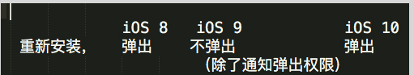
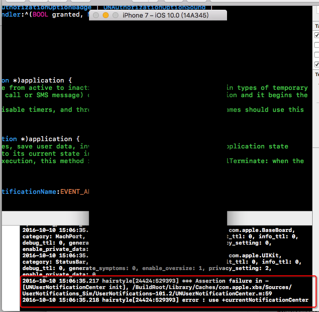
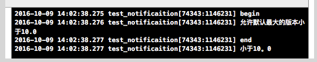
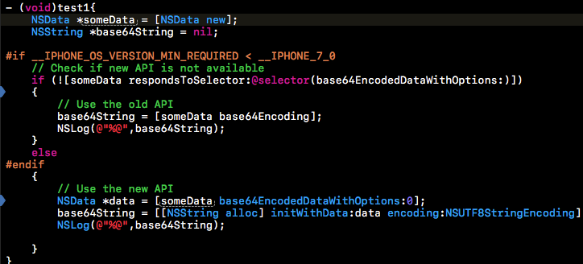
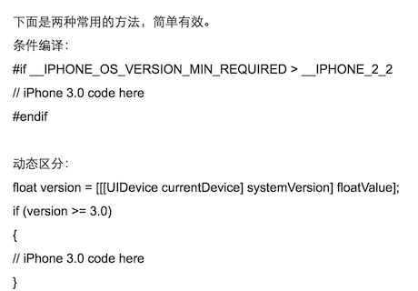
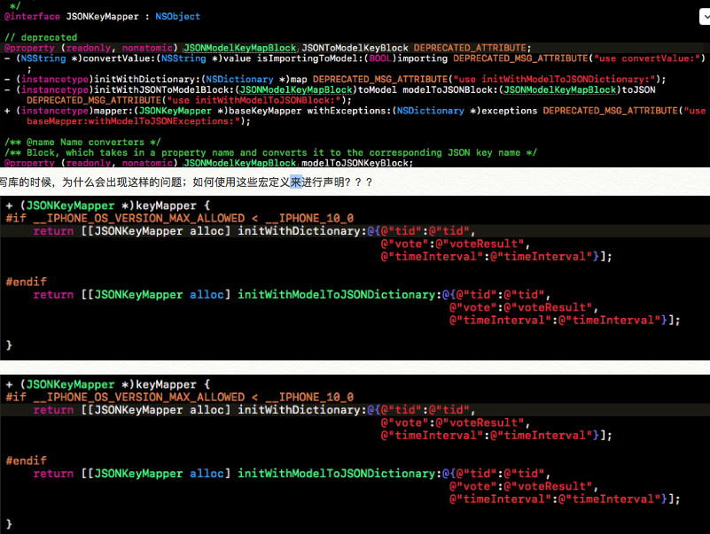
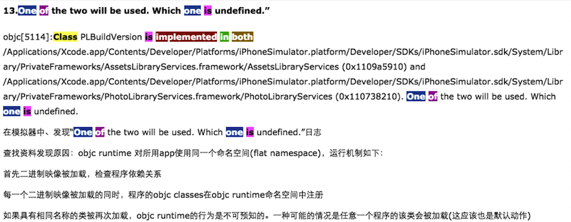
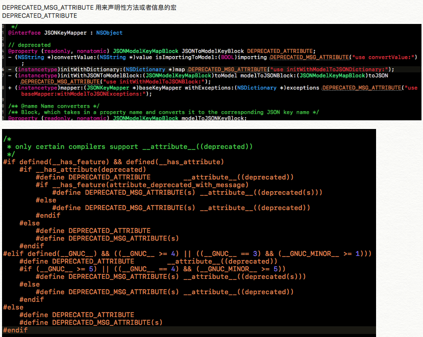
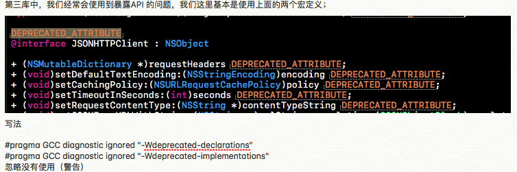

1.通知上的细节，类里面的东西，需要去查看真实的内容；

[参考链接](https://www.jianshu.com/p/5713fa2bfece)
<br/>
推送，还是会出现问题，xgpush <，看看xgpushSErivce 里面appid 和appkey是否已经对应；
通知的中心是获取的；
    UNUserNotificationCenter *center = [UNUserNotificationCenter currentNotificationCenter];
而不是new的方式进行创建的，使用功能new创建就会出现问题，屏幕黑屏，提示有使用currentNotificationCenter 获取通知中心；




2、修改需求上面的内容，应该尽可能的添加代码，而不是替换代码，尽可能少点注释

3、判断不同的版本来进行写代码： 可以通过一些宏来进行处理，
参考链接：
https://blog.devzeng.com/blog/ios-multiple-version-compatible.html
http://blog.163.com/ray_jun/blog/static/1670536422012429104151970/ 
https://blog.csdn.net/u010969412/article/details/30975301

sdk允许的最大的版本；这个和运行这个程序的ios 系统没有关系


```
__TVOS_PROHIBITED ： 禁止 TVos 上使用
 NS_AVAILABLE_IOS(3_0) ： ios 3 版本中引入
NS_DEPRECATED_IOS(2_0, 6_0); ios2 引入，ios 6 过时
NS_AVAILABLE(10_8, 6_0); mac os 10.8上引入，ios6 上引入
NS_DEPRECATED(10_0, 10_6, 2_0, 4_0); mac os 10.0 引入，mac os 10.6 上过时，ios 2.0 引入，4.0 过时；
同样类似，目前苹果就是3个类型的os
```

4、xcode 中不想升级xcode， 但是要兼容ios7 以及后面的新的ios 
我们通过可以下载对应的ios sdk放到xcode对应的位置，然后选择最小的sdk就可以了； 或设置最大的sdk等


关于sdk的兼容，我们一般是写库才会进行判断，如果是其他的，不会考虑这些库问题；我们需要兼容的是设备；应该是用UIDevice来进行判断；或者使用进程来进行判断（大才小用）；


__IPHONE_OS_VERSION_MIN_REQUIRED
这里就需要用到这个宏进行处理；
或者还有大的概念的宏定义

```
这些宏定义都是在这个头文件中： AvailabilityInternal.h
```

[sdk 上面的官方网站介绍](https://developer.apple.com/library/archive/documentation/DeveloperTools/Conceptual/cross_development/Using/using.html#//apple_ref/doc/uid/20002000-SW5)
参考链接：
[参考0](http://blog.csdn.net/xianghuibeijing/article/details/6259824)
[参考1](https://daiweilai.github.io/2015/01/20/iOS%E4%B8%AD%E7%9A%84%E9%A2%84%E7%BC%96%E8%AF%91%E6%8C%87%E4%BB%A4%E7%9A%84%E5%88%9D%E6%AD%A5%E6%8E%A2%E7%A9%B6/)

不兼容的API都会在framework release notes里标明。所以，release note是相当重要的东西

[过期的api详解](http://iosdevelopertips.com/best-practices/eveything-you-need-to-know-about-ios-and-os-x-deprecated-apis.html)







5、视频上面的一些格式
优酷 、腾讯、乐视等大型视频网站的视频地址的获取，

视频的格式：
　　M3U8视频格格式也是一种M3U，只是它的编码格式是UTF-8格式。M3U用Latin-1字符集编码。M3U8格式特点是带有一个目录信息或文件。
　　MP4视频文件 即 mp4 （文件格式） 。 MPEG-4包含了MPEG-1及MPEG-2的绝大部份功能及其他格式的长处，并加入及扩充对虚拟现实模型语言（VRML ， VirtualReality Modeling Language）的支持，面向对象的合成档案（包括音效，视讯及VRML对象），以及数字版权管理（DRM）及其他互动功能。而MPEG-4比MPEG-2更先进的其中一个特点，就是不再使用宏区块做影像分析，而是以影像上个体为变化记录，因此尽管影像变化速度很快、码率不足时，也不会出现方块画面。

http://blog.csdn.net/langeldep/article/details/8603045/
m3u8 格式的讲解

百度百科：
m3u文件 
M3U本质上说不是音频文件，它是音频文件的列表文件，是纯文本文件。你下载下来打开它，播放软件并不是播放它，而是根据它的记录找到网络地址进行在线播放。

例子说明
编辑
打开记事本，依次输入硬盘上几首MP3文件的路径，类似“H：\yinyue\来生缘.mp3……H：\yinyue \一起走过的日子.mp3”，每输入一首歌后，回车另起一行，输入所有的歌曲路径后，点开【文件】菜单，再点击【另存为】，在文件名中输入“刘德华. m3u”，点击【保存】，注意保存时，文件类型选“所有文件（?.?）”。保存完毕后，一个播放列表就完成了。可点击这个文件，验证是否已经自动打开与之关联的MP3播放软件并开始播放。当然，不只是MP3文件，只要是播放器支持的媒体文件，都可以用这个方法来做播放表。
https://zh.wikipedia.org/wiki/M3U
http://baike.baidu.com/view/718664.htm
http://www.360doc.com/content/15/1103/11/20918780_510398157.shtml
http://blog.csdn.net/bonlog/article/details/24551051
http://www.codeceo.com/article/youku-real-url.html
http://cccidea.com/it/program/134.html
http://www.jianshu.com/p/7c0179a279f1

http://www.jianshu.com/p/fd72d3cbd3dc
http://www.jianshu.com/collection/62788fc96b49
http://www.jianshu.com/search?q=opengl&page=1&type=collections
http://www.jianshu.com/collection/dfeb8e9a87db

c 语言上面的条件编译：
http://blog.sina.com.cn/s/blog_4b4b54da0100r2l6.html

