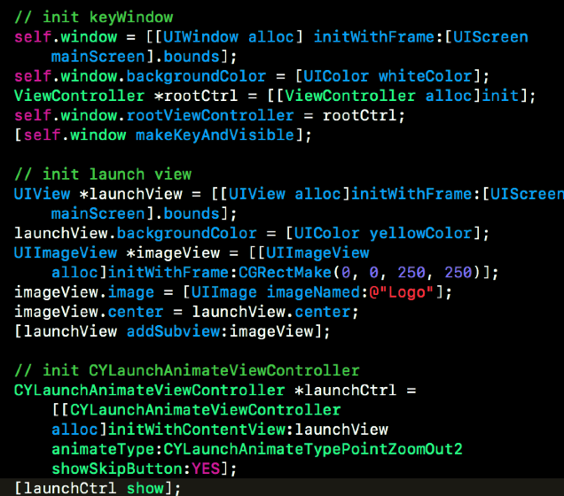
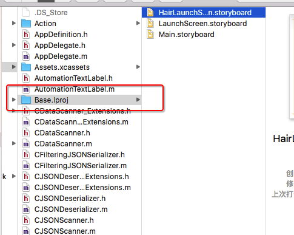

我们经常看到lanchScreen.xib 文件就是一个启动页面; 
如果要实现动态的或者短视频的广告页面，就需要使用到 多个View 来实现或者说说是vc来定义展示时间，添加在keywindow上面；
参考链接：
[启动页面bug解析](http://stackoverflow.com/questions/31881645/xcode-7-launch-screens-may-not-set-custom-classnames)
[启动页面图片没有加出来](http://blog.csdn.net/yishengzhiai005/article/details/51135282)

iOS app上面的启动页面的广告： 
（主要是在在当前启动的时候，就在keywindow 上添加广告页面）

启动静态页面的图片

每种语言都有自己的 语言代码.lproj文件夹，因为实现本地化的时候，会有多种语言；
[多种语言本地化与国际化](http://mokai.me/2015/10/iOS%E5%9B%BD%E9%99%85%E5%8C%96/)

出现启动页面的图片加载不出来，可以去查看一下几点：
之所以会出现这个问题是因为我们在创建的启动页面的时候要出现了问题；
1、一个是我们创建要创建launchScreen ，而不是我们平常的storyBoard的方式
2、我们的资源应该在创建的时候要选择相应的对应的项目，否则默认是原来的；
3、还有就是相关的图片可能是拷贝的，尽量是能够原本的拖进来，也就是我们选择附属的关系应该确定；

